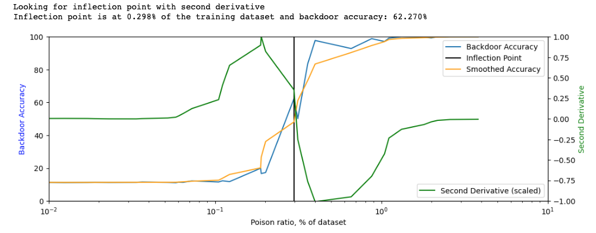

# Mithridates: Measure and Boost Robustness to Backdoor Attacks

This repo is designed to help engineers to find vulnerabilities to backdoors of 
machine learning pipelines without any training modification. We try to 
answer two questions:

1. How robust is your machine learning pipeline to unknown backdoors?
2. How to modify existing hyperparameters to boost backdoor robustness?

Current functionality:
* Can find vulnerability to strong backdoors on PyTorch pipelines.
* Dataset wrapper works on (x, y) dataset tuples. 

*This is work in progress: email 
me
([eugene@cs.cornell.edu](mailto:eugene@cs.cornell.edu)) and contribute!*
<p align="center">

</p>

*Photo of Mithridates VI Eupator,
the ruler of Pontus from 120 to 63 BC. He was rumored to include minuscule
amounts of poison in his diet to build up immunity to poisoning.* 

## Background

Data poisoning is an emerging threat to pipelines that rely on data gathered 
from multiple sources [[1]](https://arxiv.org/abs/2204.05986). A subset of 
poisoning -- backdoor attacks are 
extremely powerful and can inject a hidden behavior to the model by only 
using a small fraction of inputs. 
However, as backdoor attacks are diverse and defenses are expensive 
to integrate and maintain, there exists a problem for practical resolution.

**Main goal**: In this repo we take a **developer-centric** view of this 
problem and provide an easy-to-use tool that does 
not require  modification of the training pipeline but can help to
measure and mitigate backdoor threats of this pipeline.

## Installation

```bash
pip install -r requirements.txt
```

 !!**TODO**: make a pip installation.


## Measure robustness of an existing pipeline

To measure robustness we test how well can the model learn the **primitive 
sub-task** -- a simple task that covers large portion of the input and is 
easier to learn than other backdoors providing a strong baseline:

Our main metric is the fraction of the dataset required to compromise in 
order to make the backdoor effective. Engineers can then apply quotas or add 
more trusted data to reduce the threat. We build a poisoning curve that 
tracks how accuracy of the primitive sub-task (backdoor accuracy) changes 
while increasing training dataset poisoning ratio. 

However, it's not evident what how to measure backdoor effectiveness as even 
the backdoor might be effective even without reaching 100% accuracy. We 
propose **inflection point** of the poisoning curve as an effective metric that 
signifies a slowdown in increase of backdoor accuracy with higher compromised 
percentage, i.e. injecting would become more expensive for the attacker 
afterwards. Please see the paper for more discussion.

<p align="center">

</p>

There are three steps to measure robustness:
1. Integrate wrapper that poisons the training dataset
2. Iterate over poisoning ratio
3. Build poisoning curve and compute inflection point
 
We now provide an example for modifying MNIST training to measure robustness.
You can adapt this code to your use-case **(feel free to reach out or raise an 
Issue)**

## MNIST Example

Now we can demonstrate on MNIST PyTorch training example 
([mnist_example.py](mnist_example.py)):

### 1. Integrate wrapper: 

```python

from mithridates import DatasetWrapper

train_dataset = YOUR_DATASET_LOAD()
train_dataset = DatasetWrapper(train_dataset, percentage_or_count=POISON_RATIO)

test_dataset = YOUR_TEST_DATASET_LOAD()
test_attack_dataset = DatasetWrapper(test_dataset, percentage_or_count='ALL')

...
# TRAIN
...
test(test_dataset)
test(test_attack_dataset)

```

See [mnist_example.py#L104](mnist_example.py#L104) for sample integration of 
the wrapper into PyTorch MNIST training example. We added `--poison_ratio` 
to the arguments that can be called in bash

### 2. Iterate over poisoning ratio

We recommend using [Ray Tune](https://docs.ray.io/en/latest/tune/index.html) 
(fast, uses multiple process and GPUs) to iterate over training. For 
pipelines that are ran through shell scripts we also provide bash script below.

#### Ray

Fast way of running multiple training iterations. We only modify poison 
ratio and measure backdoor accuracy. Run `python ray_training.py --build_curve 
--run_name 
curve_experiment`:

```text
Number of trials: 40/40 (40 TERMINATED)
+---------------------+----------+--------------------+----------------+
| Trial name          | accuracy |  backdoor_accuracy |   poison_ratio |
|---------------------+----------+--------------------+----------------|
| tune_run_41558_00000|    98.52 |              11.31 |     0.0520072  |
| tune_run_41558_00001|    98.4  |              19.92 |     0.187919   |
| tune_run_41558_00002|    98.57 |              11.48 |     0.00602384 |
| tune_run_41558_00003|    98.27 |              17.33 |     0.201368   |
| tune_run_41558_00004|    98.7  |              99.15 |     1.11094    |
| tune_run_41558_00005|    98.08 |              11.33 |     0.0642598  |
| tune_run_41558_00006|    98.33 |              11.27 |     0.0171205  |
| tune_run_41558_00007|    98.49 |              11.55 |     0.105115   |
| tune_run_41558_00008|    98.35 |              11.37 |     0.0189157  |
| tune_run_41558_00009|    98.48 |              11.11 |     0.0580809  |
...
```

If your training uses scripts, add the argument `--poison_ratio`, here is 
the example **bash** [script.sh](script.sh) `./script.sh`:

```bash
set PYTHONPATH="."

for (( k = 1; k < 20; ++k ));
  do
    iteration=$((20*$k))
    echo "Running poisoning of $iteration images from MNIST dataset."
    python mnist_example.py --epochs 1 --poison_ratio $iteration

  done
```
``
The result will be saved to `/tmp/results.txt` (poison images, main accuracy,
backdoor accuracy):
```text
0.033 98.11000 11.15000
0.067 98.03000 11.35000
0.100 98.07000 13.30000
0.133 98.48000 66.28000
0.167 98.07000 49.02000
0.200 98.43000 17.78000
0.233 98.31000 67.98000
0.267 98.30000 95.61000
0.300 98.36000 82.53000
0.333 98.54000 95.04000
0.367 98.53000 86.56000
0.400 98.28000 92.34000
```


#### 3. Build a curve:

If used Ray you can use Jupyter Notebook and call 
`get_inflection_point(analysis)` from [utils.py](mithridates/utils.py), see 
[build_curve.ipynb](build_curve.ipynb).


<p align="center">

</p>


Therefore, this machine learning model is robust to poisoning of 0.2% 
dataset. However, modifying hyperparameters might further boost robustness.

# Boosting robustness with hyperparameter search

We can modify existing [ray_training.py](ray_training.py) and fix the 
poisoning ratio but add search over different hyperparameters and modify 
objective.

**TODO: will be added later.**


